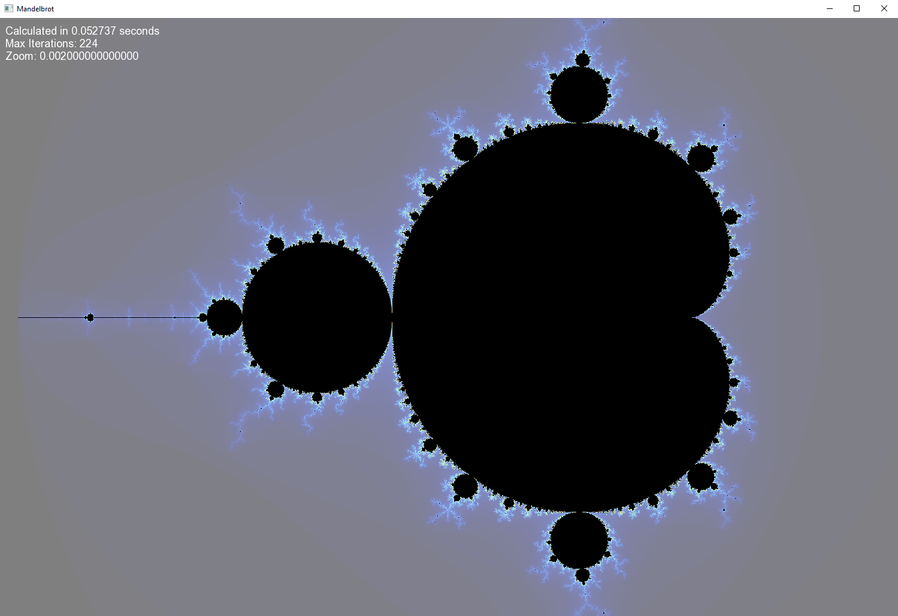

# MandelbrotSFML
A visulization of the mandelbrot set in c++ using SFML

# Usage
Either make your own Visual Studio project and run it (in Release mode for performance), or simply run the MandelbrotSFML.exe in the Release folder.

You can zoom in and out using the UP and DOWN arrow keys.
To lower or increase the number of iterations used to calculate each pixel, use the LEFT and RIGHT arrow keys.
You can move using the W, A, S, D keys.
If you want to save the current image, press ENTER and it will be saved into the source directory as mandelbrot.png.
